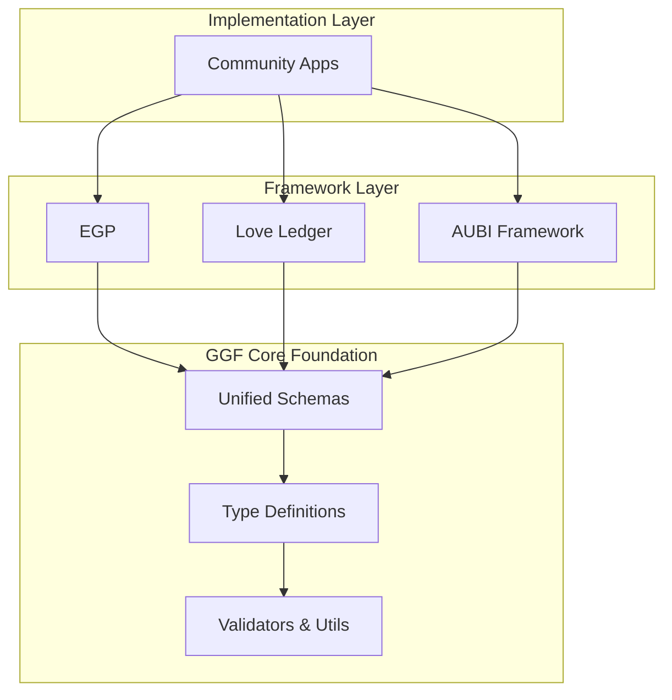

# GGF Core
## Shared Libraries and Type Definitions

Welcome to the foundational layer of the Global Governance Frameworks ecosystem! 🏗️

## Purpose

GGF Core provides the **shared infrastructure** that enables seamless integration across the Global Governance Frameworks ecosystem. It contains the schemas, types, validators, and utilities that ensure all frameworks can communicate effectively while maintaining their distinct purposes.

## What's Included

### 📋 **Unified Schemas**
- **EGP Base Schemas**: Core governance operations (`sense`, `propose`, `adopt`)
- **Love Ledger Extensions**: Care economy metadata (`care_metrics`, `currency_alloc`)
- **AUBI Integration**: Payment layer specifications (`aubi_integration`)
- **Cross-Framework Types**: Shared data structures and validation rules

### 🔧 **Developer Tools**
- **TypeScript Definitions**: Full type safety across all frameworks
- **JSON Schema Validators**: Runtime validation for all data structures
- **Conversion Utilities**: Inter-Currency Translation Layer helpers
- **Testing Fixtures**: Sample data for development and testing

### 🌐 **Integration Layer**
- **DID Utilities**: Decentralized identifier handling
- **Blockchain Helpers**: IPFS, content addressing, and verification
- **Cultural Adapters**: Tools for community-specific customization
- **Privacy Tools**: Zero-knowledge proof utilities and encryption helpers

## Ecosystem Architecture



## Key Components

### 🏛️ **EGP Integration**
```typescript
// Base EGP operation with extension points
interface EGPOperation {
  operation: 'sense' | 'propose' | 'adopt';
  timestamp: string;
  agent: string;
  location?: LocationMetadata;
  content: ContentBlock;
  extensions?: Record<string, any>; // Love Ledger, AUBI, etc.
}
```

### 💚 **Love Ledger Extensions**
```typescript
// Care economy metadata that extends EGP operations
interface CareMetrics {
  act_type: 'childcare' | 'elders' | 'ecological' | 'cultural';
  hours: number;
  impact_score: 1 | 2 | 3 | 4 | 5;
  validation?: CommunityValidation;
}

interface CurrencyAllocation {
  hearts?: number;
  leaves?: LeavesNFT;
}
```

### 🌍 **AUBI Integration**
```typescript
// Payment layer specifications
interface AUBIIntegration {
  layer: 1 | 2 | 3 | 4;
  payout_calculation: PayoutFormula;
  sunset_clause?: string; // ISO 8601 duration
  cultural_adaptations?: Record<string, any>;
}
```

### 🔄 **Inter-Currency Translation**
```typescript
// Convert between different value systems
interface ConversionRate {
  from_system: 'time_banks' | 'care_acts' | 'carbon_credits' | 'fiat';
  to_currency: 'hearts' | 'leaves' | 'fiat';
  formula: string;
  multipliers?: Record<string, number>; // Cultural, regional adjustments
}
```

## Installation & Usage

### For Framework Developers
```bash
# Install GGF Core in your framework
npm install @ggf/core

# Import schemas and types
import { EGPOperation, validateCareAct } from '@ggf/core';
import { unifiedSchema } from '@ggf/core/schemas';
```

### For Application Developers  
```bash
# Use pre-built validation and conversion tools
import { 
  validateEGPOperation,
  convertToHearts,
  createLeavesNFT 
} from '@ggf/core/utils';
```

### For Community Implementers
```bash
# Access example payloads and integration guides
git clone https://github.com/GlobalGovernanceFrameworks/ggf-core
cd ggf-core/examples
```

## Schema Evolution

### Version Management
- **Semantic Versioning**: Schema changes follow semver (major.minor.patch)
- **Backward Compatibility**: Maintained for at least 2 major versions
- **Migration Tools**: Automated conversion between schema versions
- **Community Input**: Schema changes require multi-framework review

### Extension Protocol
```json
{
  "operation": "sense",
  "schema_version": "1.2.0",
  "extensions": {
    "love_ledger": {
      "version": "0.8.0",
      "care_metrics": { ... }
    },
    "aubi": {
      "version": "1.1.0", 
      "layer_calculation": { ... }
    }
  }
}
```

## Framework Integration Examples

### 🏛️ **EGP + Love Ledger**
```json
{
  "operation": "propose",
  "timestamp": "2025-07-25T15:00:00Z",
  "agent": "did:example:weaver",
  "content": {
    "title": "Community Elder Care Program",
    "description": "Daily check-ins by volunteers"
  },
  "extensions": {
    "love_ledger": {
      "care_metrics": {
        "act_type": "elders",
        "hours": 2,
        "impact_score": 4
      },
      "currency_alloc": {
        "hearts": 40
      }
    }
  }
}
```

### 💰 **Love Ledger + AUBI**
```json
{
  "care_contribution": {
    "agent": "did:example:maria",
    "acts": [
      {
        "type": "eldercare",
        "hours": 10,
        "validation": "community_verified"
      }
    ]
  },
  "aubi_calculation": {
    "base_layer_1": 1200,
    "layer_2_bonus": {
      "hearts_earned": 200,
      "multiplier": 1.3,
      "total_bonus": 260
    }
  }
}
```

### 🌱 **Full Ecosystem Integration**
```json
{
  "operation": "adopt",
  "agent": "baz:indigenous_council",
  "content": {
    "title": "Watershed Restoration Project"
  },
  "extensions": {
    "love_ledger": {
      "care_metrics": {
        "act_type": "ecological", 
        "hours": 40,
        "impact_score": 5
      },
      "currency_alloc": {
        "hearts": 100,
        "leaves": {
          "amount": 20,
          "nft_metadata": {
            "gps": "coordinates",
            "eco_act": "stream_restoration"
          }
        }
      }
    },
    "aubi": {
      "layer": 2,
      "green_job_score": 1.4,
      "total_payout": 380
    }
  }
}
```

## Developer Resources

### 🧪 **Testing & Validation**
```javascript
import { validateUnifiedSchema } from '@ggf/core/validators';

const isValid = validateUnifiedSchema({
  operation: 'sense',
  timestamp: new Date().toISOString(),
  agent: 'did:example:user',
  extensions: {
    love_ledger: { ... }
  }
});
```

### 🔄 **Currency Conversion**
```javascript
import { convertToHearts, InterCurrencyLayer } from '@ggf/core/converters';

const heartsEarned = convertToHearts({
  system: 'care_acts',
  hours: 5,
  impact_score: 4,
  cultural_multiplier: 1.2
});
```

### 🏗️ **Schema Extensions**
```javascript
// Extend schemas for custom frameworks
import { createExtensionSchema } from '@ggf/core/schema-builder';

const customSchema = createExtensionSchema({
  namespace: 'my_framework',
  fields: {
    custom_metric: 'number',
    special_validation: 'string'
  }
});
```

## Community Standards

### 📐 **Design Principles**
- **Interoperability First**: All schemas must support cross-framework communication
- **Cultural Sensitivity**: Extension points for community-specific adaptations
- **Privacy Protection**: Built-in support for zero-knowledge proofs and user control
- **Accessibility**: Multi-modal support (text, audio, visual, tactile)
- **Versioning**: Clear migration paths and backward compatibility

### 🤝 **Contribution Guidelines**
- **RFC Process**: Major schema changes require Request for Comments
- **Multi-Framework Review**: Changes must be approved by EGP, Love Ledger, and AUBI maintainers
- **Community Input**: Indigenous communities and pilot BAZs have veto power over cultural adaptations
- **Testing Requirements**: All changes must include comprehensive test suites
- **Documentation**: Clear examples and migration guides for all changes

### 🛡️ **Security Standards**
- **Cryptographic Verification**: All schemas support content addressing and verification
- **Privacy by Design**: Personal data minimization and user-controlled sharing
- **Cultural Protection**: Traditional knowledge flagging and access control
- **Fraud Prevention**: Built-in validation and anomaly detection support

## Framework Connections

### 🏛️ **[Emergent Governance Protocol](https://github.com/GlobalGovernanceFrameworks/egp)**
- **Imports**: Base operation schemas, validation utilities
- **Provides**: Governance operation structure for other frameworks
- **Integration**: Extension points for care economy and payment data

### 💚 **[Love Ledger](https://github.com/GlobalGovernanceFrameworks/love-ledger)**
- **Imports**: EGP schemas, DID utilities, blockchain helpers
- **Extends**: Care metrics, Hearts/Leaves allocation, community validation
- **Provides**: Care economy data structures for AUBI integration

### 🌍 **[AUBI Framework](https://github.com/GlobalGovernanceFrameworks/aubi-framework)**
- **Imports**: EGP schemas, Love Ledger extensions, conversion utilities
- **Extends**: Payment calculations, layer specifications, LMCI metrics
- **Provides**: Economic distribution logic for the entire ecosystem

## Implementation Support

### 📚 **Documentation**
- **Integration Guides**: Step-by-step framework connection instructions
- **API References**: Complete TypeScript definitions and JSON schemas
- **Example Payloads**: Real-world data samples for all use cases
- **Migration Tools**: Version upgrade and conversion utilities

### 🛠️ **Development Tools**
- **CLI Tools**: Schema validation, conversion testing, example generation
- **IDE Extensions**: VSCode/IntelliJ plugins for schema autocomplete
- **Testing Utilities**: Mock data generators, validation test suites
- **Debugging Tools**: Schema diff viewers, integration trace analyzers

### 🌐 **Community Resources**
- **Schema Registry**: Searchable catalog of all available schemas and extensions
- **Integration Examples**: Real implementations from pilot communities
- **Cultural Adaptations**: Community-contributed localization patterns
- **Best Practices**: Proven patterns for framework integration

## Ecosystem Benefits

### For **Framework Developers**
- **Reduced Complexity**: Shared infrastructure eliminates duplicate code
- **Type Safety**: Full TypeScript support across all integrations
- **Consistent APIs**: Standardized patterns for data exchange
- **Community Support**: Shared maintenance and improvement efforts

### For **Application Builders**
- **Single Dependency**: One package provides all framework integration capabilities
- **Validated Schemas**: Runtime validation prevents integration errors
- **Rich Examples**: Comprehensive sample code for all use cases
- **Future-Proof**: Automatic compatibility with framework updates

### For **Communities**
- **Cultural Control**: Extension points enable community-specific adaptations
- **Data Sovereignty**: Built-in privacy and access control mechanisms
- **Accessibility**: Multi-modal support for diverse participation needs
- **Interoperability**: Easy connection between different community systems

## Quality Assurance

### 🧪 **Testing Strategy**
- **Unit Tests**: Every utility function and validator thoroughly tested
- **Integration Tests**: Cross-framework compatibility continuously verified
- **Schema Tests**: All JSON schemas validated against example data
- **Performance Tests**: Conversion and validation speed benchmarked

### 📊 **Monitoring & Metrics**
- **Usage Analytics**: Anonymous tracking of schema adoption and usage patterns
- **Error Reporting**: Automatic collection of validation failures for improvement
- **Performance Monitoring**: Conversion speed and memory usage optimization
- **Community Feedback**: Regular surveys and feedback collection from implementers

### 🔄 **Continuous Integration**
- **Automated Testing**: All commits tested against multiple framework versions
- **Schema Validation**: Changes verified against real community data
- **Breaking Change Detection**: Automatic alerts for compatibility issues
- **Documentation Updates**: Auto-generated docs from schema changes

## Future Roadmap

### 🎯 **Short Term (Q1-Q2 2025)**
- Core schema stabilization and TypeScript definitions
- Basic validation and conversion utilities
- Integration with initial EGP, Love Ledger, and AUBI implementations
- Community feedback integration and iteration

### 🚀 **Medium Term (Q3-Q4 2025)**
- Advanced privacy tools and zero-knowledge proof utilities
- Cultural adaptation frameworks and localization tools
- Performance optimization and scalability improvements
- Comprehensive documentation and developer resources

### 🌍 **Long Term (2026+)**
- AI-assisted schema evolution and migration tools
- Advanced fraud detection and security utilities
- Inter-planetary data exchange protocols (space governance integration)
- Quantum-resistant cryptographic upgrade pathways

## Contact & Resources

- **Repository**: [github.com/GlobalGovernanceFrameworks/ggf-core](https://github.com/GlobalGovernanceFrameworks/ggf-core)
- **Documentation**: [globalgovernanceframeworks.org/core](https://globalgovernanceframeworks.org/core)
- **NPM Package**: [@ggf/core](https://npmjs.com/package/@ggf/core)
- **Community**: globalgovernanceframeworks@gmail.com
- **Issue Tracker**: Report bugs, request features, propose schema changes
- **Discussion Forum**: Community chat for integration questions and collaboration

## License

GGF Core is licensed under the MIT License to ensure maximum compatibility and adoption across the ecosystem, while respecting Indigenous data sovereignty principles and community ownership rights.

---

*"One foundation, infinite possibilities. GGF Core enables the Global Governance Frameworks ecosystem to flourish together."*

**Status**: Repository creation and initial schema development beginning Q1 2025. Join us in building the foundation for regenerative governance! 🏗️✨
